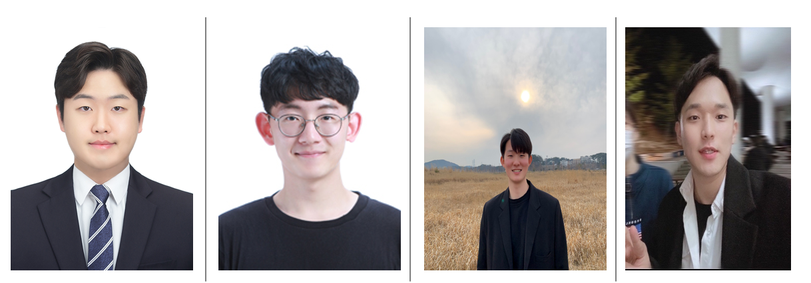

- Add go back.

# APT(AI Personal Trainer)


<b><p align="center">
WELCOME TO AI-FITNESS FRIEND  <br>
YOUR PERSONAL AI TRAINING ASSITANT  
</b></p>

<br>


-------------------
### Member
  

>　　　___Jemin Rhee　　　　　　　　　Minsik Kim　　　　　　　　　Inseon Choi　　　　　　　　Jun Park___
  
------------------
<br><br><br><br>
  

# Background

### 1) Problems

<br> 

__1.1) Due to the COVID-19, there are problems with fitness and outdoor exercise. It is difficult to exercise in the public indoor space and feels uncomfortable to exercise outdoors which requires contact with other people.__  

This data is the result of <Awareness Survey on the Relationship between COVID-19 and Exercise> conducted in December 2020 by the market research company, Embrain Trend Monitor. (For 1,000 men and women aged 19 to 59)

<p align="center">
  
 </P>
  
<p align="center"> Exercise survey results with difficulties due to COVID-19 (Embrain, 2020) </P>  

As you can see from the results of the survey, it was confirmed that COVID-19 significantly increased people's fear and discomfort about indoor fitness and outdoor exercise that need to do with a partner.


__1.2) People’s new lifestyle and effects of COVID-19 increase interest in Home Training.__
<p align="center">
  
</p>
<p align="center">
Increasing the amount of social mentions and consumer counseling related to home training (Korea Consumer Agency, 2021)  
 </p>
Consumer’s interest in Home Training is increasing, and as a result, needs for various new Home Training services is also increasing. In this situation, we want to provide an interesting home training service through AI, voice functions, and additional interactions.


<br>


### 2) Target User

 1) People who often exercise at home   
2) People who cannot go to the gym due to COVID-19   
3) People who need help because they do not know how to exercise alone (ex. exercise routine, correct posture...)   
4) People who are bored when exercising alone at home or need fun elements (motivation)  

<br>


### 3) Goal
AI-fitness friend (AFF)’s goal is to help our users when they have
difficulty doing fitness, training, or doing exercise. To be specific, we want to offer a
personalized fitness training that can be done anytime, anywhere. It can guide our
users full body posture information, which shows the exact current posture of their
exercises, especially sit-ups, push-ups, squats, and lunges.
1. Be active and healthy with AI-Fitness Friend (AFF)
2. AI-Fitness Friend (AFF) can make home fitness highly effective and can
provide you a great motivation
3. AI-Fitness Friend (AFF) can give you guidance for your exercise posture and
motions


<br>

# Main Contents

### 1) Modeling

  

__Good Image for Modeling(LEFT)__  
- 이미지를 제대로 학습한 것들 
- 300-500장으로 자세별로 학습

__Bad Image for Modeling(RIGHT)__  
- 이미지를 제대로 인식하지 못한 자세들 제거
- 모델의 정확도에 부정적인 영향

<br></br>

### 2) Demo Video  


 
### 3) Screens Definition  


- 3-1) Select Language  
  
  

Before starting the exercise, a user can
select the language of the 'voice' that is
used in the service. (Korean/English).


- 3-2) Select Personal Trainer’s Voice

  

Allows the user to select the concept
of AI trainer voice from multiple
concepts (e.g. sweet, scary,
swearing version).


- 3-3) Select Exercise Course
    
  

Allows the user to select the exercise
method and exercise routines.
Method selection: (set or individual) exercise.
Routine selection: exercise course selections.


<br>


- 3-4) Full Body Workout

   

Allows the user to select the type of full body
workouts.
* Select exercise difficulties
Allows the user to select the exercise intensity
ATHENE : Level1
AGON : Level2
APHRODITE : Level3
HERAKLES : Level4


<br>


- 3-5) Partial Exercise

  
  

Allows the user to select the partial exercise.


<br>


- 3-6) Full Body Workout Instructions
    
  

When the user select full body workout,
it guides the exercise routines.
There is the ‘Start’ button on the bottom

<br>


- 3-7) Count exercise rep


  
  
AI-Fitness Friend count the number when
the user is doing the exercises.
Check exercise postures
AI-Fitness Friend ensures that the user is
performing the selected exercise in the
correct positions.
Correct exercise postures
- AI-Fitness Friend let you know that If the
exercise posture is not going right, it sends out
a warning tone to correct its posture.
- Ai-fitness friend shows the numerical values
that tells the user how much the exercise
posture is correctly done.
  
  
<br>


- 3-8) Encouraging Messages

  

After the user reaches to the goal
number of repetitions, it automatically
redirects to the encouraging message
page before the result page. The user
can select whether go back to the
homepage or do workout more.
*There is a background song playing in
the encouraging message page.


<br>


- 3-9)  Exercise Result

  

It shows exercise time, number of
repetitions, and calories burned etc

<br>


- 3-10)  Workout Recommendation

 

On the screen, a user can see list of
recommended exercises.

<br>

### 4) User test

 


 


<br><br><br><br>


# Conclusion

Throughout this semester, we want to build an application - AI-Fitness Friend -
that can check a user's body posture. As people accelerate more into more digital
forms of fitness guide, our application is expected to become more increasingly
relevant. Users can use their computer or smartphone camera to
recognize their exercise postures and movements, while this app can guide you
through the correct postures with voice helpers. Whether your fitness goals are to build muscle, get toned or lose weight fast, Ai-Fitness Training will be the simplest way to do fitness training exercises. 


------------------------------

## Our Progress
- [Proposal Writing](https://drive.google.com/file/d/1pEoPPCt36UKADAJdx5IqUf4Vuq_qEnYO/view?usp=sharing)
- [System Requirement](https://drive.google.com/file/d/1IWdFfeAiEZahiah-xVK_3B4RaLW6f9-B/view?usp=sharing)
- [System Design](https://drive.google.com/file/d/1eE9Yk5YtMaVo1Io81t-JQtwonypES4Ob/view?usp=sharing)
- [User Research Report](https://docs.google.com/document/d/1jqc1s6sToKwdoI7mRpGyhH1XZ-IPq1BXANixW069v0M/edit?usp=sharing)


## Reference
- [LIFTR: A Virtual Personal Fitness Trainer - Powered by Computer Vision & AI](https://www.youtube.com/watch?v=tZcRYcjTwWA)
- [Teachable Machine github](https://github.com/googlecreativelab/teachablemachine-community)
- [Teachable Machine 생활코딩](https://opentutorials.org/course/4548/28897)
- [Teachable Machine 공식 홈페이지](https://teachablemachine.withgoogle.com/)
- [Teachable Machine으로 AI 헬스 트레이너 만들기](https://www.youtube.com/watch?v=9SwdGFzFb5Y)
- [Teachable Machine으로 과일도감 만들기](https://www.youtube.com/watch?v=USQGTW34lO8)


### Source Code for push-up (Sample)
```
<!DOCTYPE html>
<html lang="ko">

<head>
    <meta charset="UTF-8">
    <!-- FAVICON-->
    <link rel="icon" href="favicon.ico">
    <!-- Required meta tags -->
    <meta name="viewport" content="width=device-width, initial-scale=1, shrink-to-fit=no">
    <meta http-equiv="X-UA-Compatible" content="ie=edge">
    
    <!-- Bootstrap CSS -->
    <link rel="stylesheet" href="https://stackpath.bootstrapcdn.com/bootstrap/4.4.1/css/bootstrap.min.css"
        integrity="sha384-Vkoo8x4CGsO3+Hhxv8T/Q5PaXtkKtu6ug5TOeNV6gBiFeWPGFN9MuhOf23Q9Ifjh" crossorigin="anonymous">
    <link rel="stylesheet" type="text/css" href="https://fonts.googleapis.com/earlyaccess/notosanskr.css">

    <script type="text/javascript" src="/eon-chart.js"></script>
    <script type="text/javascript" src="https://pubnub.github.io/eon/v/eon/1.0.0/eon.js"></script>
    <link type="text/css" rel="stylesheet" href="https://pubnub.github.io/eon/v/eon/1.0.0/eon.css"/>
    <title>PUSH UP</title>
    <link rel="stylesheet" href="style.css">
</head>


<body>
    <div class="container mt-5">
        <div class="frame">

                <!-- 스퀏 카운터-->
                <div class="headline">
                    <div class="small">PUSH UP</div>Counter
                
                </div>
                <div class="circle-big">
                    <div class="text">
                        <span id="counter">0</span><div class="small"></div>

                    </div>
                    <svg>
                        <circle class="bg" cx="57" cy="57" r="52" />
                        <circle class="progress" cx="57" cy="57" r="52" />
                    </svg>
                </div>


                <!--스퀏 퍼센테이지-->
                <div class="headline">
                    <div class="small">GOOD</div>
                
                </div>
                <div class="circle-big">
                    <div class="text">
                        <span id="probability">0</span>%<div class="small"></div>

                    </div>
                    <svg>
                        <circle class="bg" cx="57" cy="57" r="52" />
                        <circle class="probprog" cx="57" cy="57" r="52" />
                    </svg>
                </div>
                
...

            // finally draw the poses
            drawPose(pose);
        }

        function drawPose(pose) {
            if (webcam.canvas) {
                ctx.drawImage(webcam.canvas, 0, 0);
                // draw the keypoints and skeleton
                if (pose) {
                    const minPartConfidence = 0.5;
                    tmPose.drawKeypoints(pose.keypoints, minPartConfidence, ctx);
                    tmPose.drawSkeleton(pose.keypoints, minPartConfidence, ctx);
                }
            }
        }

    </script>
</body>
</html>


```
